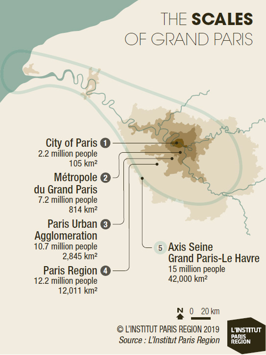

# Paris2050

> A repo to try understand and predict Paris urban expansion in 2050. Climate change requires us to think smarter if we want to organize cities in an intelligent way. We need to organize cities to host a growing number of people. We need tools to understand the future of cities. Like living organism, they have a life of their own. We can accompany their growing and evolution with the right tools
>
> 

## Objective

Analyse the evolution of urbanized Paris land from 2000 to 2018 and estimate its evolution until 2050.

## Get started

Clone this repo:

```
git clone git@github.com:martinoauriane/Paris2050.git
```

## How the predictions work

We're using linear regression to train AI on data and predict a particular behavior, in this case urban expansion.

Linear regression is a data analysis technique that predicts the value of unknown data using another apparent, known data value. It mathematically models the unknown or dependent variable and the known or independent variable as a linear equation.

###### Panda Library

For that we're using the Panda library. Pandas is a software library written for the Python programming language for data manipulation and analysis.

The name is derived from the term "[**pan**el **da**ta](https://en.wikipedia.org/wiki/Panel_data "Panel data")", an [econometrics](https://en.wikipedia.org/wiki/Econometrics "Econometrics") term for [data sets](https://en.wikipedia.org/wiki/Data_set "Data set") that include observations over multiple time periods for the same individuals, as well as a play on the phrase "Python data analysis". [Wes McKinney](https://en.wikipedia.org/wiki/Wes_McKinney "Wes McKinney") started building what would become Pandas at [AQR Capital](https://en.wikipedia.org/wiki/AQR_Capital "AQR Capital") while he was a researcher there from 2007 to 2010.

A bit of history: Developer [Wes McKinney](https://en.wikipedia.org/wiki/Wes_McKinney "Wes McKinney") started working on Pandas in 2008 while at [AQR Capital Management](https://en.wikipedia.org/wiki/AQR_Capital "AQR Capital") out of the need for a high performance, flexible tool to perform [quantitative analysis](<https://en.wikipedia.org/wiki/Quantitative_analysis_(finance)>) "Quantitative analysis (finance)") on financial data. Before leaving AQR, he was able to convince management to allow him to [open source](https://en.wikipedia.org/wiki/Open_source "Open source") the library. Another AQR employee, Chang She, joined the effort in 2012 as the second major contributor to the library.

Panda is a very useful tool to convert data into a DataFrame, a data structure easier to manipulate and visualize.

###### scikit-learn

Linear Regression is a machine learning algorithm. It predicts a continuous value, such as temperature of house prices. scikit-learn is one of the various Python libraries used to implement linear regression on a given dataset.

First, we need to train the modal so it can learn from known data and analyze its relation to the variable we want to predit.

We're using the fit( ) method of scikit-learn, using training data as argument.

```
model.fit(X_train, y_train)
```

We're then using the predict( ) method of our trained object. We should receive an array of predicted values for the targeted variable.

```
predictions = model.predict(X_test)
```

## Testing Data

###### Source data: Corine Land Cover (CLC) + INSEE

**The CORINE Land Cover (CLC)** geographic database is a biophysical inventory of land cover. It is produced within the framework of the European Copernicus earth observation program (39 European states). CORINE Land Cover comes from the visual interpretation of satellite images and is available for the following years: 1990, 2000, 2006 and 2012. These state bases are accompanied by the change bases 1990-2000, 2000-2006 and 2006-2012 (data on the portions of the territory having changed land use).

The mainland and the overseas departments are covered by CLC. For Guyana, only the coastal strip was treated.

**INSEE's** (National Institute of Statistics and Economic Studies is a general directorate of the Ministry of the Economy and Finance) mission is to collect, analyze and disseminate information on the French economy and society throughout its territory.

###### **Data tools : GeoPandas**

GeoPandas is an open source project to make working with geospatial data in python easier.

Get started:

```
`pip install geopandas`
```
